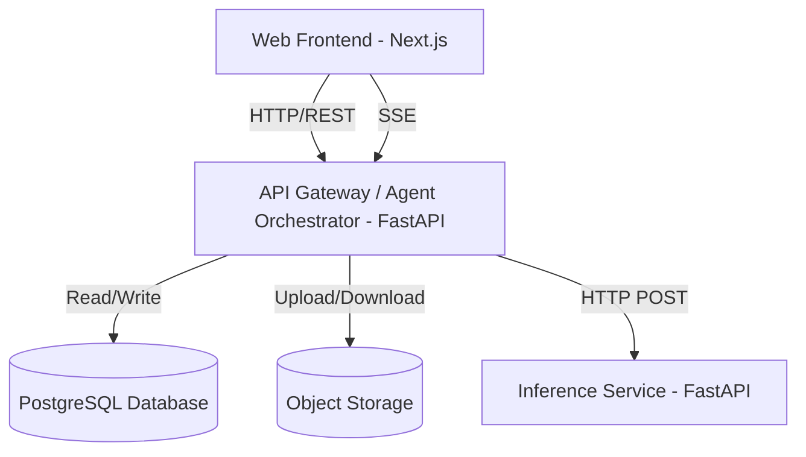

# Nutrition Scanner - Architecture

## High-Level Architecture

The system follows a microservices-inspired architecture designed for cloud deployment and scalability.

### Component Responsibilities

1. **Frontend (Next.js)**
   - Responsible for presentation and UI state.
   - Handles image upload.
   - Connects to SSE (Server-Sent Events) for real-time agent updates.
   - Hosted on Vercel or inside a Docker container.

2. **Backend API (FastAPI)**
   - Entry point for all external requests.
   - Runs the LangGraph AI Agent workflows.
   - Does **NOT** load ML models directly.
   - Orchestrates the agents (Food Recognition, Ingredients, Nutrition, Quality).
   - Manages database state and storage.
   - Centralized JSON logging and metrics gathering.

3. **Inference Service (FastAPI)**
   - Dedicated service for running Large Vision-Language Models (VLM).
   - Simple HTTP interface (`/infer`).
   - Can be scaled independently of the backend.
   - Designed to run on GPU instances (AWS EC2, RunPod, Modal).
   - The backend passes the image (base64) and prompt, and receives structured JSON.

4. **Database (PostgreSQL)**
   - Stores jobs, pipeline metadata, agent execution latency, model version, and inference results.
   - Schema is prepared for multi-user authentication in the future.

5. **Object Storage**
   - Stores raw uploaded images.
   - An abstraction allows switching between `Local`, `Supabase`, or `AWS S3`.

## Deployment Strategy

The architecture ensures that you do not need to run a GPU 24/7 if you don't have to. You can host the Frontend and Backend on cheap/free serverless platforms, and spin up the Inference Service on a pay-per-second GPU platform like Modal or RunPod.
