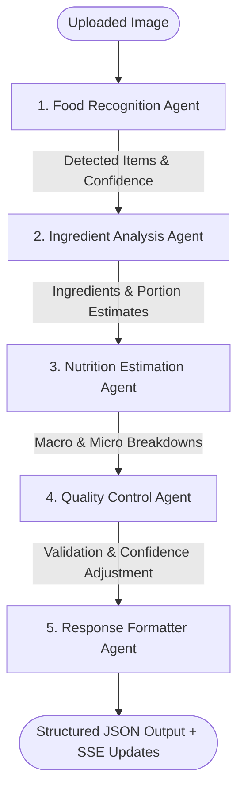

# Nutrition Scanner - System Architecture

## Overview & Architecture Pattern

The **Nutrition Scanner** application is designed as a **Modular Monorepo with Microservice-Ready Decoupled Components**. This hybrid approach provides the developer simplicity of a monorepo while keeping service boundaries strictly isolated for horizontal cloud scaling and serverless execution.

```
+-----------------------------------------------------------------------------------+
|                                 NUTRITION SCANNER                                 |
|                                                                                   |
|  +-----------------------+     +------------------------+     +----------------+  |
|  |       apps/web        |     |        apps/api        |     | apps/inference |  |
|  |  (Next.js App Router) |     |  (FastAPI + LangGraph) |     | (FastAPI VLM)  |  |
|  +-----------+-----------+     +-----------+------------+     +-------+--------+  |
|              |                             |                          |           |
|              |         HTTP / REST         |                          |           |
|              +---------------------------->+                          |           |
|              |         SSE Stream          |                          |           |
|              +<============================+                          |           |
|                                            |    HTTP / Base64 VLM     |           |
|                                            +------------------------->+           |
|                                            |                          |           |
|                                +-----------v------------+             |           |
|                                |   packages/ai-agents   |             |           |
|                                | (5-Agent Graph Engine) |             |           |
|                                +------------------------+             |           |
|                                                                                   |
|  +------------------------+    +------------------------+    +-----------------+  |
|  |  packages/shared-types |    |   packages/evaluation  |    | packages/config |  |
|  |   (Shared Interfaces)  |    |  (Benchmark Pipeline)  |    |  (Eslint/TS)    |  |
|  +------------------------+    +------------------------+    +-----------------+  |
|                                                                                   |
+-----------------------------------------------------------------------------------+
```

---

## Modular Monorepo vs Microservice Design

1. **Modular Monorepo Structure (`npm workspaces` / `pip editable packages`)**
   - **Shared Codebase**: Standardized types, ESLint rules, and AI graph nodes reside in the `/packages` folder.
   - **Single Unified Repository**: Versioning and developer workflows are managed in one place without needing NPM registry publishing for internal tools.
   - **Integrated Local Fallback**: Next.js route handlers (`/api/v1/analyze/...`) can act as a standalone application gateway when FastAPI is offline, keeping the app resilient for single-container serverless deployments.

2. **Decoupled Microservice Runtime**
   - **Service-Oriented Boundaries**: `apps/web` (UI), `apps/api` (Agent Orchestration & DB), and `apps/inference` (VLM Open-Source Model Host) run in independent Docker containers.
   - **Independent Scaling**: The inference engine can be deployed onto GPU hosts (e.g. Modal, RunPod, AWS EC2 with CUDA), while `apps/api` runs on cheap serverless CPU container nodes (e.g. Cloud Run, Render).

---

## Complete Multi-Agent AI Workflow (LangGraph)

The core AI engine uses a 5-agent graph orchestrated via **LangGraph**:



### Agent Pipeline Details

1. **Food Recognition Agent**
   - **Role**: Identifies main food items/dishes in the image.
   - **Outputs**: Dish names (`name`) and recognition confidence score (`confidence`).

2. **Ingredient Analysis Agent**
   - **Role**: Breaks down recognized food into probable constituent ingredients and portion estimates.
   - **Outputs**: Ingredient names, estimated weight/volume (e.g., `150g`, `1 cup`), and individual confidence scores.

3. **Nutrition Estimation Agent**
   - **Role**: Calculates nutritional breakdown based on dishes and portioned ingredients.
   - **Outputs**: Calories (kcal), Protein (g), Carbohydrates (g), Fat (g), Fiber (g), Sugar (g), Sodium (mg) with confidence scores per metric.

4. **Quality Control Agent**
   - **Role**: Validates mathematical and physical consistency (e.g., verifying if total calories match macronutrient sum: `1g protein = 4kcal`, `1g carbs = 4kcal`, `1g fat = 9kcal`).
   - **Outputs**: Quality report containing validation flag (`valid`), warning messages, and adjusted overall confidence.

5. **Response Formatter Agent**
   - **Role**: Assembles the normalized schema and produces standard JSON consumed by the database and Next.js frontend.

---

## Server-Sent Events (SSE) Streaming Architecture

To deliver an interactive UX without blocking long AI processing jobs, the API uses a background job queue combined with Server-Sent Events (SSE):

1. **Job Creation (`POST /api/v1/analyze`)**:
   - The user uploads an image.
   - The backend validates the image, creates a database job record with status `queue`, saves the raw image to storage, and enqueues background execution.
   - Returns a `job_id` instantly (`200 OK`).

2. **Event Streaming (`GET /api/v1/analyze/{job_id}/stream`)**:
   - The frontend opens an EventSource SSE connection to stream updates.
   - As each agent in the LangGraph graph executes, `apps/api` emits node progress, state updates, and latency measurements (`latency_ms`).
   - Final result payload is transmitted upon completion and persisted into PostgreSQL.

---

## Data & Storage Tier

- **PostgreSQL Database**: Stores jobs, user records, raw results, agent latency breakdowns, and model versions using SQLAlchemy async sessions (`asyncpg`).
- **Pluggable Storage Layer**: Supports `Local` filesystem storage, `Supabase` object storage, or `AWS S3` bucket adapters seamlessly.
